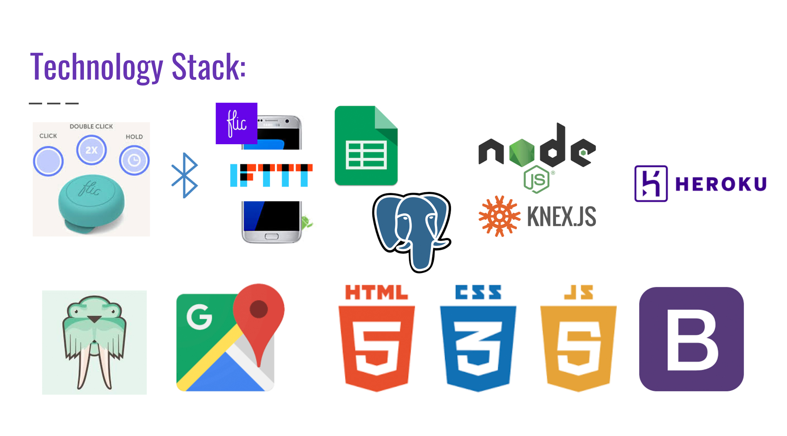

# Tracker-server
>Server and database for the tracking interface using Google Maps API

The data gathered from a wearable clicker button goes through an Android app and a Google Sheet IFTTT recipe to a PostgreSQL database.

